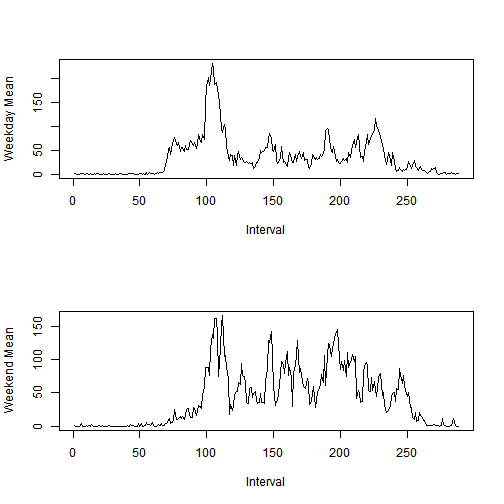

## Loading and preprocessing the data

First, we open the zip file and load the .csv contained inside.


```r
data <- read.csv(unzip("activity.zip"))
data$date <- as.Date(data$date)
summary(data)
```

```
##      steps             date               interval     
##  Min.   :  0.00   Min.   :2012-10-01   Min.   :   0.0  
##  1st Qu.:  0.00   1st Qu.:2012-10-16   1st Qu.: 588.8  
##  Median :  0.00   Median :2012-10-31   Median :1177.5  
##  Mean   : 37.38   Mean   :2012-10-31   Mean   :1177.5  
##  3rd Qu.: 12.00   3rd Qu.:2012-11-15   3rd Qu.:1766.2  
##  Max.   :806.00   Max.   :2012-11-30   Max.   :2355.0  
##  NA's   :2304
```


## What is mean total number of steps taken per day?

We can use the aggregate function to total up the number of steps per day, call a histogram on the step data, and then look at the summary function to see at the mean and median for the daily data.


```r
daily_steps <- aggregate(steps ~ date, data = data, sum)
hist(daily_steps$steps, breaks=10)
```

 

```r
summary(daily_steps$steps)
```

```
##    Min. 1st Qu.  Median    Mean 3rd Qu.    Max. 
##      41    8841   10760   10770   13290   21190
```


## What is the average daily activity pattern?
We can again use the aggregate function to get an average number of steps per time interval, and plot the data with a time series plot.

```r
daily_activity <- aggregate(steps ~ interval, data = data, mean)
plot(daily_activity$interval, daily_activity$steps, type="l", xlab="Intervals", ylab="Average number of steps")
```

 

We can then find the interval with the number of stpes

```r
daily_activity$interval[[which.max(daily_activity$steps)]]
```

```
## [1] 835
```

## Imputing missing values
We can find the number of missing values by using the complete.cases() function.

```r
sum(!complete.cases(data))
```

```
## [1] 2304
```

We can then fill in these NAs by using the mean data for that interval.

```r
for (row in 1:nrow(data)) {
  if (is.na(data[row, ]$steps)) {
    data[row, ]$steps <- daily_activity$steps[[which(daily_activity$interval == data[row, ]$interval)]]
  }
}
```

Finally, we can remake the histogram and summary like in part 1, and compare and contrast.

```r
daily_steps <- aggregate(steps ~ date, data = data, sum)
hist(daily_steps$steps, breaks=10)
```

 

```r
summary(daily_steps$steps)
```

```
##    Min. 1st Qu.  Median    Mean 3rd Qu.    Max. 
##      41    9819   10770   10770   12810   21190
```

There's only small changes. The frequency of values is roughly the same, with the peak around the median increasing slightly, and the other values decreasing slightly. The mean and median are now exactly equal, instead of off by 10. In other words, there is not a huge impact on filling in the NAs with the average value, other than what looks like a decrease in the standard deviation (which makes sense, as we're introducing new data at the mean, so the spread or variance of the data is decreasing.)

## Are there differences in activity patterns between weekdays and weekends?
We can make a new factor variable by using the weekdays() function. In the data loading process, we already converted the date column into Date objects.

```r
data$weekday <- rep(NA, nrow(data))
for(row in 1:nrow(data)) {
  if((weekdays(data$date[[row]]) == "Saturday") || (weekdays(data$date[[row]]) == "Sunday")) {
    data$weekday[[row]] <- "weekend"
  } else {
    data$weekday[[row]] <- "weekday"
  }
}
data$weekday <- as.factor(data$weekday)
table(data$weekday)
```

```
## 
## weekday weekend 
##   12960    4608
```

Next, we can tidy up the data.

```r
mean_data <- with(data, tapply(steps, list(interval, weekday), mean))
tidy_data <- data.frame(c(1:288), mean_data[, 1], mean_data[ , 2])
names(tidy_data) <- c("interval", "weekdayMean", "weekendMean")
summary(tidy_data)
```

```
##     interval       weekdayMean       weekendMean     
##  Min.   :  1.00   Min.   :  0.000   Min.   :  0.000  
##  1st Qu.: 72.75   1st Qu.:  2.247   1st Qu.:  1.241  
##  Median :144.50   Median : 25.803   Median : 32.340  
##  Mean   :144.50   Mean   : 35.611   Mean   : 42.366  
##  3rd Qu.:216.25   3rd Qu.: 50.854   3rd Qu.: 74.654  
##  Max.   :288.00   Max.   :230.378   Max.   :166.639
```

Then, we can plot it.

```r
par(mfcol=c(2, 1))
plot(tidy_data$interval, tidy_data$weekdayMean, type="l", xlab="Interval", ylab="Weekday Mean")
plot(tidy_data$interval, tidy_data$weekendMean, type="l", xlab="Interval", ylab="Weekend Mean")
```

 


